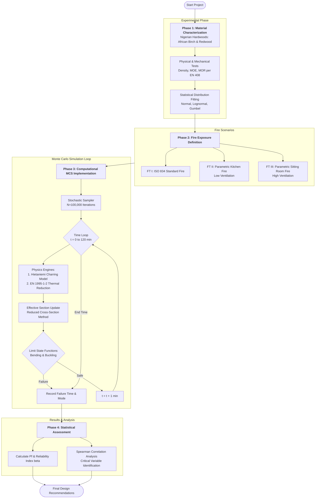

# Timber Truss Fire Reliability Project

This project focuses on the **Probabilistic Fire Performance Assessment** of indigenous Nigerian timber species used in roof truss systems. It transitions from traditional deterministic design to advanced performance-based safety evaluation using **Monte Carlo Simulation (MCS)**.

## 1. Project Context
Traditional design codes (like NCP 2) often ignore the complex interactions of fire behavior, material variability, and structural response in tropical timbers. This research (based on a PhD Thesis) provides a scientific framework to:
- Characterize Nigerian hardwoods (**African Birch** and **Redwood**).
- Experimentally determine charring rates under standard and parametric fire scenarios.
- Quantify structural reliability using probabilistic methods.

## 2. Research Components

### A. Material Characterization
Testing of forty (40) specimens per species to determine:
- **Density ($\rho$)**: Measured per EN 408.
- **Mechanical Properties**: Modulus of Elasticity (MOE) and Modulus of Rupture (MOR) via 3-point and 4-point bending.
- **Statistical Fitting**: Normal, Lognormal, and Gumbel distributions.

### B. Fire Performance Scenarios
Three fire exposures were analyzed:
- **FT I**: Standard nominal fire (ISO 834).
- **FT II**: Parametric Kitchen fire (Ventilation-controlled, low oxygen).
- **FT III**: Parametric Sitting Room fire (Fuel-controlled, high ventilation).

### C. Treatment Evaluation
Evaluation of **Borax-based** fire retardant efficacy, showing 14–27% reductions in charring rates across all scenarios.

## 3. Computational Framework (`mcs_simulation.py`)
The project includes a Python implementation of the **Probabilistic Reliability Analysis**.

### Features:
- **Hietaniemi Charring Model**: Sophisticated time-dependent charring prediction.
- **Structural Analysis**: Integration-based effective cross-section analysis.
- **Monte Carlo Engine**: Efficiently executes 100,000+ iterations per scenario.
- **Sensitivity Analysis**: Identifies influential parameters (Spearman correlation).

## 4. Key Findings
- **High-Density Superiority**: *Erythrophleum suaveolens* (Red Wood) consistently outperforms medium-density species in fire stability.
- **Calibration Needs**: Indigenous hardwoods require a multiplier of ~1.3 on standard Eurocode 5 charring rates for accurate safety in ventilated fires.
- **Reliability Indices**: Borax treatment elevates $\beta$ to safe levels even for medium-density species under severe exposure.

## 5. Getting Started

### Prerequisites
- Python 3.8+
- libraries: `numpy`, `scipy`, `pandas`, `matplotlib`, `tqdm`

### Execution
```bash
python3 mcs_simulation.py
```

## 6. Project Documentation & Artifacts
- **Technical Logic**: [technical_documentation.md](file:///home/salsdev/.gemini/antigravity/brain/c54b21ae-6482-4a3d-a1fb-6e829c8b1b9b/technical_documentation.md)
- **Execution Walkthrough**: [walkthrough.md](file:///home/salsdev/.gemini/antigravity/brain/c54b21ae-6482-4a3d-a1fb-6e829c8b1b9b/walkthrough.md)
- **Extracted Data**: `methodology.txt`, `thesis.txt` (raw text from source documents)

## 7. Project Flowchart
The following diagram illustrates the complete workflow from experimental testing to reliability outcomes.



---
*Created as part of the Timber Roof Truss Fire Reliability Analysis Study.*
